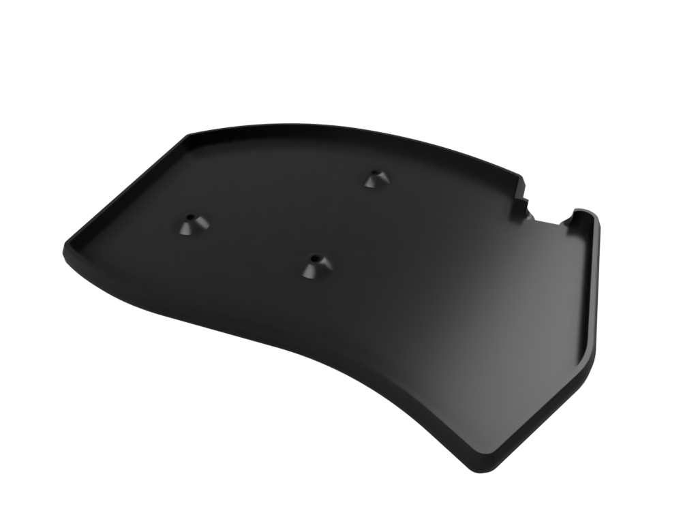

## Version differences

- Fillet: the outer edge of the case has a fillet finish
- Chamfer: the outer edge of the case has a chamfer finish
- Capture: the case has a hole to hold a small nut to secure the pcb with M2 screws
- Inserts: the case has a hole where you can melt a heat-insert to secure the pcb with M2 screws

> **Note**
> Capture is optimized for resin prints, inserts is optimized for FDM.

The outer diameter of the hole **in the inserts model** is `3.4mm` and the depth is `3.76mm`

## Preview

## Known Issues

- This design provides a single part that needs to be mirrored in the slicer software to print the left side. However, there are very slight misalignments bewteen the two PCBs that cause the screw holes to be *slightly* off-center. The design is still functional and all screws can be mounted.
- The cutout for the power switch isn't big enough to reach the switch comfortably. This could be improved but it's still very usable.
- When using a very low infill value, the curved bottom wall of the fillet case is weak. Printing at a higher infill is recommended.
